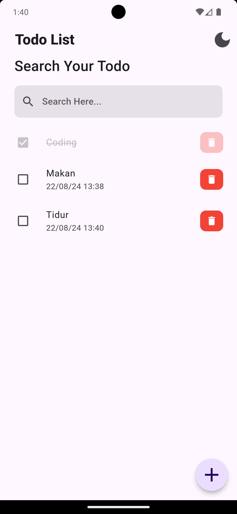

# Retods(Todo App)

Retods is a task management application designed to help you easily organize and complete your daily activities. With a simple and intuitive interface, you can quickly add, edit, and delete tasks, as well as set reminders with specific dates and times. With Retods, you can stay organized, boost productivity, and ensure no tasks are missed.

# App View
- **Home Dark Mode**

  
- **Home Light Mode**

  
- **Add Todo**

# Fitur
- **Task Management**: Add new tasks, mark them as completed or incomplete, and remove unnecessary tasks.
- **Alarm Reminders**: Set alarms for each task and receive notifications when the task deadline approaches.
- **Dark and Light Themes**: Choose between dark or light themes to suit your visual preferences.
- **Local Storage**: Save task data locally using an SQLite database for offline access.
- **Task Search**: Easily search for tasks when managing a large number of them.

# Tools
- cupertino icons
- sqflite
- path
- provider
- shared preferences
- intl
- android alarm manager plus
- flutter local notifications

# Donwload
Try Now https://bit.ly/ReTodsApp
